# Algorithmic Art

## Patterns in Chaos and the Beauty of Fractals
These images were generated using `matplotlib` and `seaborn` based on basic fractal algorithms.  
Make sure you have `numpy` installed if you want to try them out.

### Joy Division Album Cover / [Notebook](Joy_Devision.ipynb)

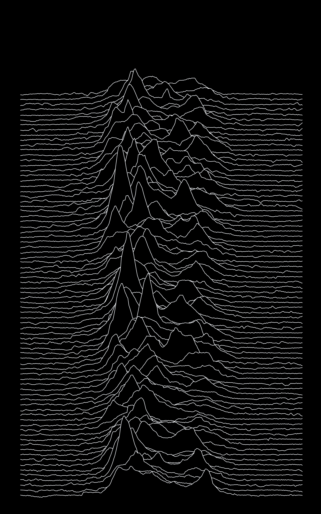

### Multi-Pendulum Harmonograph / [Notebook](Multi-pendulum_Harmonograph.ipynb)
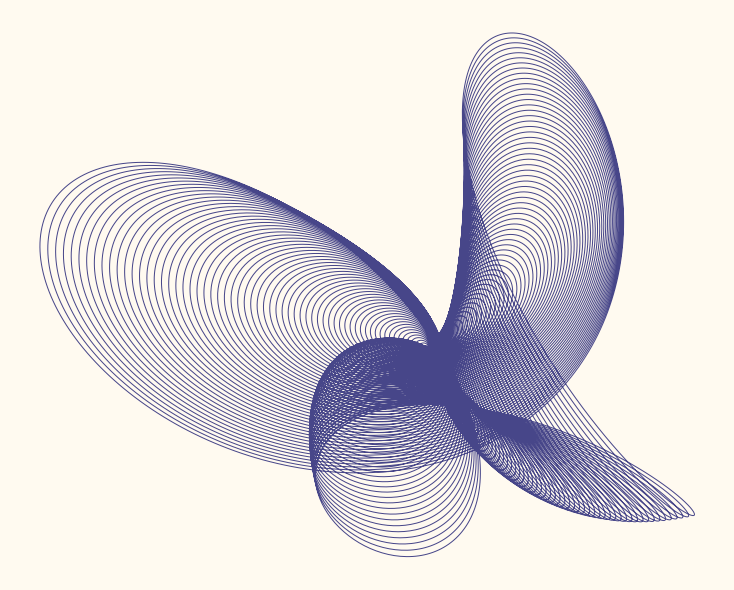
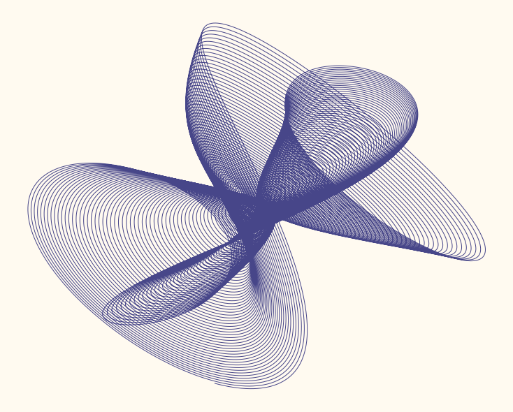

### Filled-in Julia Set / [Notebook](julia-set.ipynb)
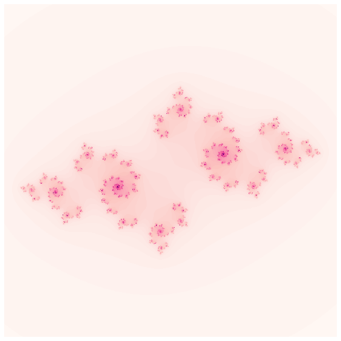
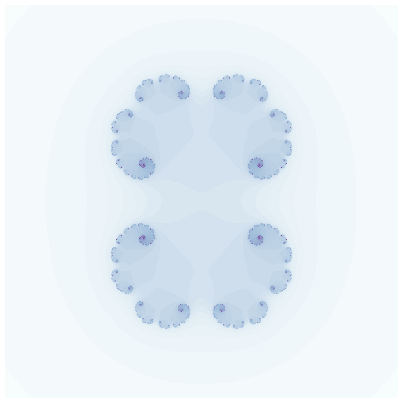
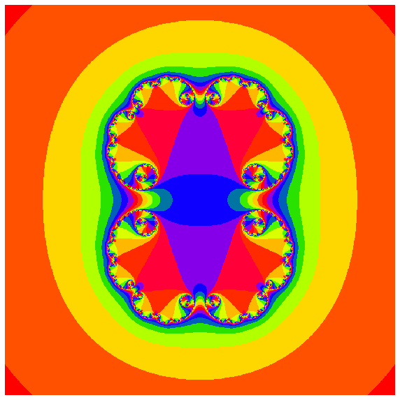

### Classic Hamiltonian Systems  / [Notebook](Hamiltonian_tapestry.ipynb)
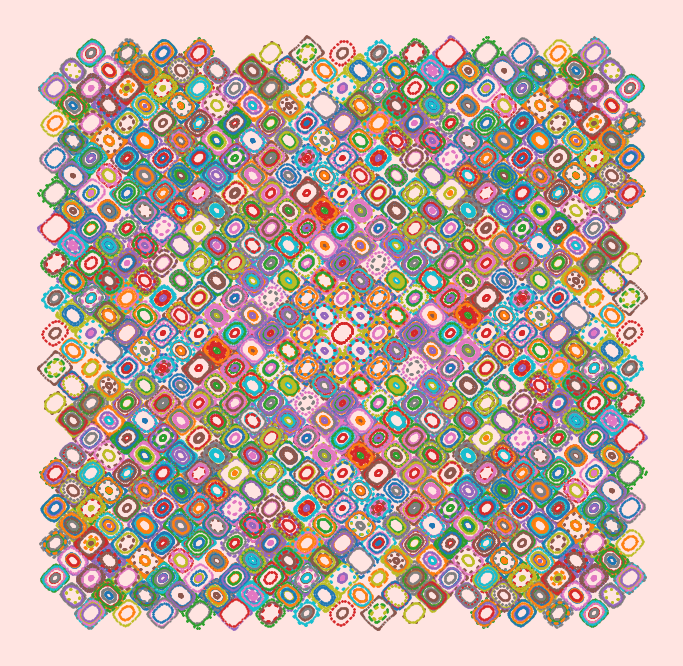
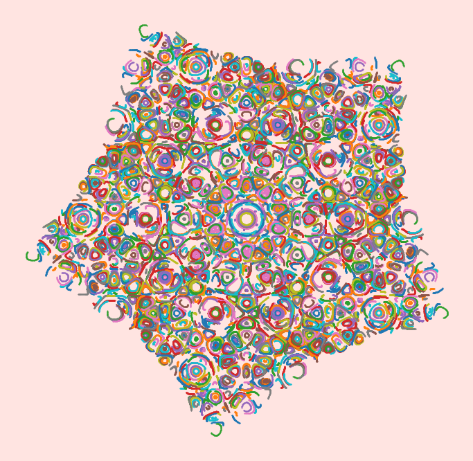

### Phyllotaxie / [Notebook](phyllotaxy1.ipynb)
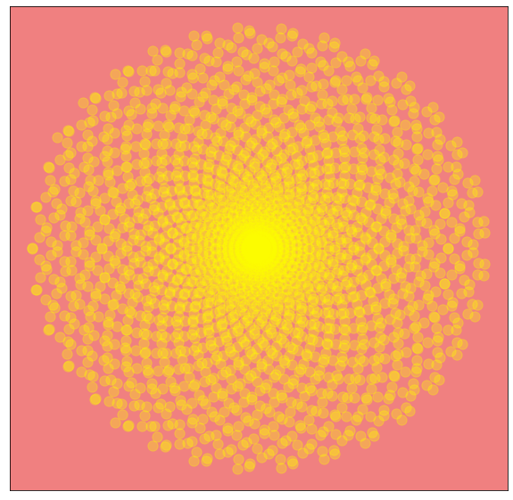
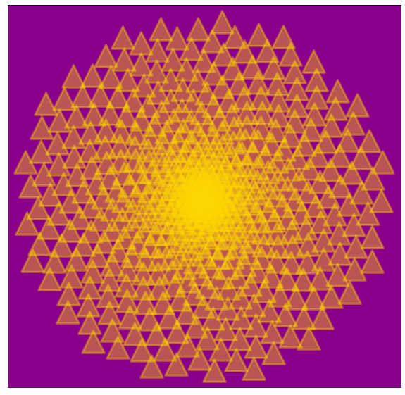

### Mandelbrot Sets / [Notebook](mandelbrot.ipynb)
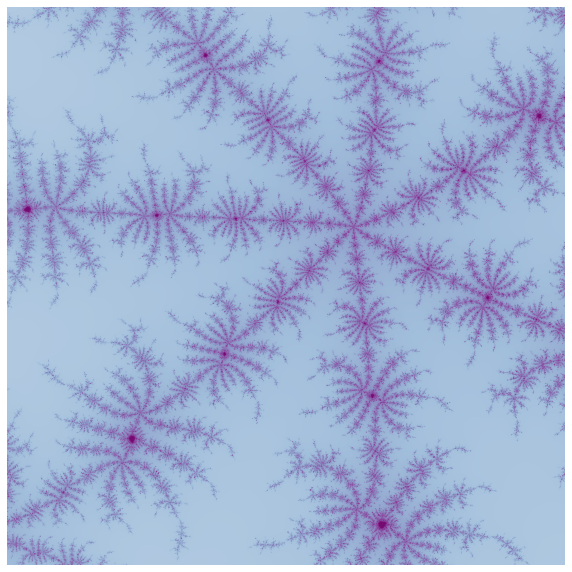
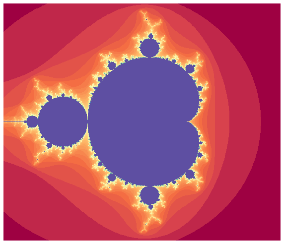

### Voronoi Tessellation / [Notebook](voronoi_diagram.ipynb)
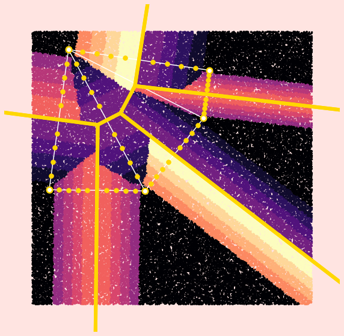
