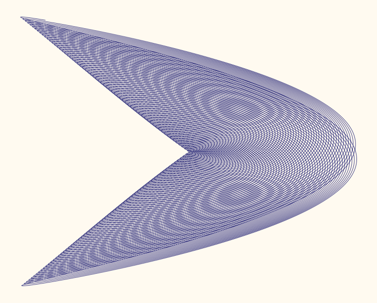

# Algorithmic Art

## Patterns in Chaos and the Beauty of Fractals
These images were generated using `matplotlib` and `seaborn` based on basic fractal algorithms.  
Make sure you have `numpy` installed if you want to try them out.
### Multi-Pendulum Harmonograph / [Repo](https://github.com/skacem/Algorithmic-Art/blob/db8493591bf96bc27e2d7bc567aa539bc24c7bdc/Multi-pendulum_Harmonograph.ipynb)

### Filled-in Julia Set / [Repo](https://github.com/skacem/Algorithmic-Art/blob/1ca12d78976ee4d67317788f80b1ac71a8777b3b/filled-julia.ipynb)

### Classic Hamiltonian Systems  / [Repo](Hamiltonian_tapestry.ipynb)

### Phyllotaxie / [Repo]([phyll](https://github.com/skacem/Algorithmic-Art/blob/1ca12d78976ee4d67317788f80b1ac71a8777b3b/phyllotaxy1.ipynb))

### Mandelbrot Sets / [Repo](https://github.com/skacem/Algorithmic-Art/blob/1ca12d78976ee4d67317788f80b1ac71a8777b3b/mandelbrot.ipynb)

